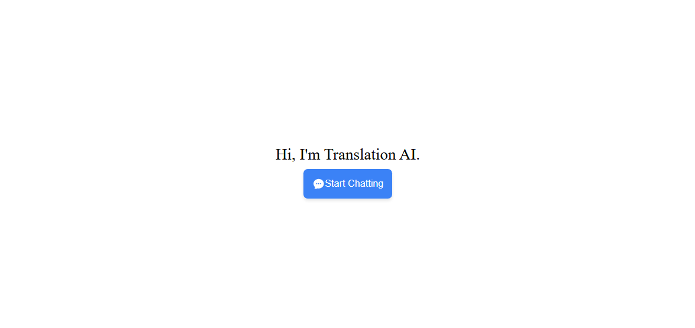
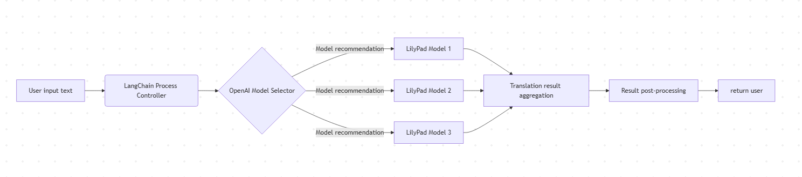
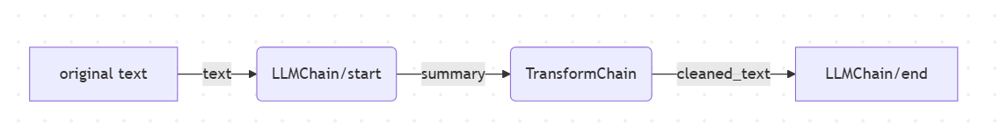
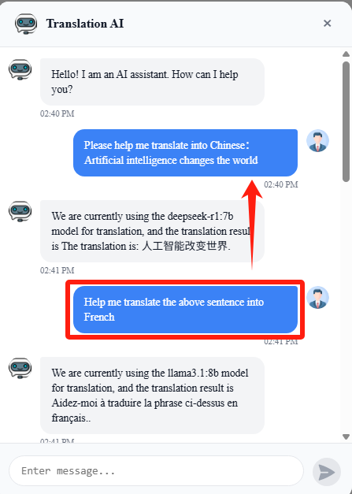

# LangChain Translation Tool



## Description

The LangChain Translation tool can perform translation tasks and automatically identify the optimal model for translation.

1. First, the translation tool is based on the LangChain framework and OpenAI API. Combining LangChain's process orchestration capabilities and OpenAI's model selection capabilities, it can intelligently select different translation models on the LilyPad platform according to needs and complete high-quality translation tasks.

2. Workflow




```bash
Process description

1. Input reception: The system receives the text to be translated and the target language requirements entered by the user.

2. Model selection: Use OpenAI API to analyze the input text features and recommend the most suitable Lilypad translation model.

3. Translation execution: The selected Lilypad model performs the actual translation work.

4. Result processing: Perform necessary post-processing on the translation results (such as format adjustment, quality inspection).

5. Result return: Return the final translation result to the user.
```

## Technical Support

1. **LangChain**: Mainly manage the arrangement and decision-making of the entire translation process.

    **Core Concept**: Chaining multiple LLM operations or tool calls into a workflow.
    
    **Memory Management**： Translation context preservation
    

2. **OpenAI Model Selector**: Intelligently select the most suitable translation model based on the input content.This selection process ensures that the translation is accurate and contextual, taking into account various relevant factors such as language pair, text complexity and the specific field or context of the translation task.

    The first step in the process involves analyzing the input content to understand its characteristics. The model assesses several key aspects, including:

    **· Language Pair**: The input and target languages ​​are identified. For example, translating from English to French or from English to Japanese requires different models or specializations.

    **· Text Complexity**: The content’s complexity is evaluated, such as whether it’s a simple conversation, a technical document, or a piece of creative writing. This helps the selector understand whether a more advanced model is needed.

    **· Domain Context**: The context in which the translation is used is considered. For example, translating legal documents requires a specialized model that understands legal terminology, while translating marketing materials might require a model that focuses on tone and persuasion.

3. **LilyPad Model Execution Layer**: Strong multilingual support, capable of handling translations between different language pairs, including low-resource languages ​​and more complex languages.And it has a deep understanding of context, which means it does not rely solely on word-by-word translation, but is able to capture the context within sentences, paragraphs, and even conversations

    Many models are provided(e.g., `deepseek-r1:7b、llama3.1:8b、llava:7b、openthinker:7b`)

## Configuration

1. Create the env var file
    ```bash
    Copy .env.example to .env and fill in the appropriate values.
    ```

2. Generate and set the Agent Private Key

    We can apply for API Key on the lilypad official website. https://anura.lilypad.tech/auth
    
   - Copy the private key (e.g., `MgCbWL...6wFKE=`) and set it to the `VITE_LILYPAD_API_KEY` env var.
   - Copy the base url (e.g., `https://anura-testnet.lilypad.tech/api/v1`) and set it to the `VITE_LILYPAD_API_URL` env var.


## Start Demo
### 1. Environment and Development Tools

1.Node.js 14 or later installed

2.npm 7 or later installed

3.Yarn v1 or v2 installed


### 2. Download Source Code

Download the source code with the following command:

```
git clone https://github.com/black-domain/lilypad-translator-agent.git
```

### 3. Install Dependencies

Install dependencies with the following command:

```
yarn or npm
```

After yarn, you will get a 'node_modules' folder in the root directory.

### 4. Run

1.Open http://localhost:5173 in browser and have fun

2.We just need to send the AI ​​tool the sentence you want to translate and the language you want to translate it into.

```bash
For example: "Please help me translate into Chinese: Artificial intelligence changes the world." 
```

